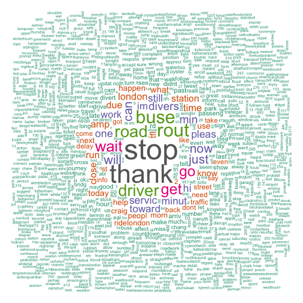

## Introduction

Project Idea

1. Sentiment analysis to
        investigating passengers' dynamic attitude changes towards TfL's bus service
2. Word Cloud to
        Understand the reasons of why people hold their opinions
3. Visualise the result

--- 

## Sentiment analysis

1. Give 1 to 5 to positive words, -1 to -5 to negative,calculate and normarlise the results' score. Results are save to tsopinion.RData image which contains a timeseries object named value

 

---

## Word Cloud

1. Additional packages [tm](http://cran.r-project.org/web/packages/tm/vignettes/tm.pdf), [wordcloud](http://cran.r-project.org/web/packages/wordcloud/wordcloud.pdf), [memoise](http://cran.r-project.org/web/packages/memoise/memoise.pdf), [shinyIncubator](https://github.com/rstudio/shiny-incubator), [dplyr](http://cran.r-project.org/web/packages/dplyr/dplyr.pdf) will be used. A global R code will be used to processing tweets analysis. The purpose of processing is to get a word frequency matrix

```r
library(tm);library(wordcloud);library(memoise);library(dplyr)
tweets <- read.csv("~/Developing-Data-Products/tweets.csv", stringsAsFactor = FALSE)
tweets <- tbl_df(tweets);tweets <- select(tweets, interaction.content);names(tweets) <- c("text")
tweets <- gsub("(f|ht)(tp)(s?)(://)(.*)[.|/](.*)", "", tweets$text)
tweets <- as.data.frame(tweets);myCorpus <- Corpus(VectorSource(tweets$tweets))
myCorpus <- tm_map(myCorpus, content_transformer(tolower))
myCorpus <- tm_map(myCorpus, removePunctuation)
myStopwords <- c(stopwords("english"), "tflbusalerts", "mayoroflondon", "tflofficial", "tfltrafficnews","tflwaystopay", "viajeramlg","franbig","debbiepj10", "halshinnie", "bus")
myCorpus <- tm_map(myCorpus, removeWords, myStopwords)
myCorpusCopy <- myCorpus;myCorpus <- tm_map(myCorpus, stemDocument)
tdm <- TermDocumentMatrix(myCorpus, control = list(wordLengths = c(1, Inf)))
m <- as.matrix(tdm);word.freq <- sort(rowSums(m), decreasing = TRUE);head(word.freq)
```

```
##   stop  thank   rout   buse   road driver 
##    404    358    241    236    208    204
```

---

## Visualise
- © Weijia Chen Reserves All Rights, 2014
- The domo of the sentiment analysis can be access by the [passatt](https://weijia.shinyapps.io/passatt/) project

```r
wordcloud(words = names(word.freq), freq = word.freq, min.freq = 3, 
          random.order = FALSE,colors=brewer.pal(8, "Dark2"))
```

 


